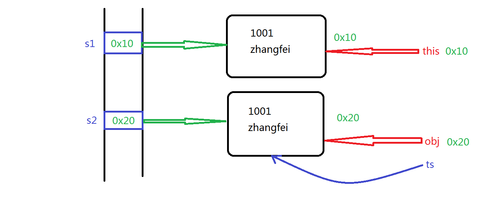
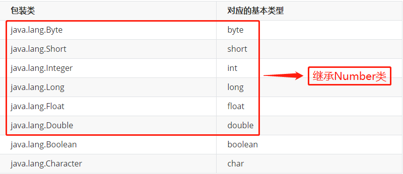

# 模块三
## 1.1 Object类的概述
### 1.1.1 基本概念
> - java.lang.Object类是Java语言中类层次结构的根类，也就是说任何一个类都是该类的直接或者间接子类。
> - 如果定义一个Java类时没有使用extends关键字声明其父类，则其父类为 java.lang.Object 类。
> - Object类定义了“对象”的基本行为, 被子类默认继承。
### 11.2.2 常用的方法
|方法声明 | 功能介绍|
| :----: |:----:|
| Object()| 使用无参方式构|
|boolean equals(Objectobj)|用于判断调用对象是否与参数对象相等。该方法默认比较两个对象的地址是否相等，与 == 运算符的结果一致若希望比较两个对象的内容，则需要重写该方法。若该方法被重写后，则应该重写hashCode方法来保证结果的一致性。|
|int hashCode()|用于获取调用对象的哈希码值(内存地址的编号)。若两个对象调用equals方法相等，则各自调用该方法的结果必须相同若两个调用对象equals方法不相等，则各自调用该方法的结果应该不相同。为了使得该方法与equals方法保持一致，需要重写该方法|
|String toString()|用于获取调用对象的字符串形式该方法默认返回的字符串为：包名.类名@哈希码值的十六进制为了返回更有意义的数据，需要重写该方法使用print或println打印引用或字符串拼接引用都会自动调用该方法。|
|Class<?> getClass() |用于返回调用对象执行时的Class实例，反射机制使用。|
- 关于equals的比对机制
>
> <center>图1.1 equals方法的原理分析</center>
- eg:
```java
import java.util.Objects;
/**
 * Student类
 */
public class Student extends Object {
    private int id; // 用于描述学号的成员变量
    private String name; // 用于描述姓名的成员变量

    public Student() {
    }

    public Student(int id, String name) {
        setId(id);
        setName(name);
    }

    public int getId() {
        return id;
    }

    public void setId(int id) {
        if (id > 0) {
            this.id = id;
        } else {
            System.out.println("学号不合理哦！！！");
        }
    }

    public String getName() {
        return name;
    }

    public void setName(String name) {
        this.name = name;
    }

    @Override
    public boolean equals(Object o) {
        if (this == o) return true;
        if (o == null || getClass() != o.getClass()) return false;
        Student student = (Student) o;
        return id == student.id &&
                Objects.equals(name, student.name);
    }

    @Override
    public int hashCode() {
        return Objects.hash(id, name);
    }

    @Override
    public String toString() {
        return "Student{" +
                "id=" + id +
                ", name='" + name + '\'' +
                '}';
    }
/*
    @Override
    public boolean equals(Object o) {
        if (this == o) return true;
        if (o == null || getClass() != o.getClass()) return false;

        Student student = (Student) o;

        if (id != student.id) return false;
        return name != null ? name.equals(student.name) : student.name == null;
    }

    @Override
    public int hashCode() {
        int result = id;
        result = 31 * result + (name != null ? name.hashCode() : 0);
        return result;
    }

 */
    /**
     * 为了比较两个对象的内容，也就是学号信息需要重写该方法
     */
    // Student this = s1;
    // Object obj = s2;
    /*
    @Override
    public boolean equals(Object obj) {
        // 当调用对象和参数对象指向同一个对象时，则内容一定相同
        if (this == obj) return true;
        // 当调用对象为不为空而参数对象为空时，则内容一定不相同
        if (null == obj) return false;
        // 判断obj指向的对象是否为Student类型的对象，若是则条件成立，否则条件不成立
        if (obj instanceof Student) {
            Student ts = (Student) obj;
            // 以学号作为基准判断两个对象是否相等  int是基本数据类型，内存空间中放的就是数据本身，使用 == 可以判断数据是否相同
            //return this.getId() == ts.getId();
            // 以姓名作为基准判断两个对象是否相等  String是引用数据类型，内存空间中放的是地址，使用 == 判断地址是否相同
            // 也就是判断两个对象中姓名字符串的地址是否相同，不够完美
            //return this.getName() == ts.getName();
            return this.getName().equals(ts.getName()); // 比较姓名字符串的内容是否相同
        }
        // 否则类型不一致没有可比性，则内容一定不相同
        return false;
    }
    */
    /**
     * 为了使得该方法的结果与equals方法的结果保持一致，从而满足Java官方的常规协定，需要重写该方法
     */
    /*
    @Override
    public int hashCode() {
        //return getId(); // 不再代表内存地址的编号了
        final int type = 12;
        //return type*31 + getId();
        return type*31 + getName().hashCode();
    }
    */
    /**
     * 为了返回更有意义的字符串数据，则需要重写该方法
     */
    /*
    @Override
    public String toString() {
        return "Student[id = " + getId() + ", name = " + getName() + "]";
    }
     */
}


```
```java
/**
 *测试类 
 */
public class StudentTest {

    public static void main(String[] args) {

        // 1.使用有参方式构造Student类型的两个对象并判断是否相等
        Student s1 = new Student(1001, "zhangfei");
        //Student s2 = new Student(1002, "guanyu");
        Student s2 = new Student(1001, "zhangfei");
        //Student s2 = s1;  // 表示s2和s1都指向了同一个对象，地址相同了
        // 下面调用从Object类中继承下来的equals方法，该方法默认比较两个对象的地址，可以查看源码验证
        // 当Student类中重写equals方法后，则调用重写以后的版本，比较内容
        //boolean b1 = s1.equals(s2);
        //Student s3 = null;
        //boolean b1 = s1.equals(s3);
        //Student s3 = s1;
        boolean b1 = s1.equals(s2);
        System.out.println("b1 = " + b1); // false true
        System.out.println(s1 == s2); // 比较地址  false

        System.out.println("----------------------------------------------------------");
        // 下面调用从Object类中继承下来的hashCode方法，获取调用对象的哈希码值(内存地址的编号)
        // 当Student类中重写hashCode方法后，则调用重写以后的版本
        int ia = s1.hashCode();
        int ib = s2.hashCode();
        System.out.println("ia = " + ia);
        System.out.println("ib = " + ib);

        System.out.println("----------------------------------------------------------");
        // 下面调用从Object类中继承下来的toString方法，获取调用对象的字符串形式：包名.类名@哈希码值的十六进制
        // 当Student类中重写toString方法后，则调用重写以后的版本：Student[id = 1001, name = zhangfei]
        String str1 = s1.toString();
        System.out.println("str1 = " + str1); // com.lagou.task11.Student@55d
        System.out.println(s1); // 当打印一个引用变量时会自动调用toString方法
        String str2 = "hello" + s1;
        System.out.println("str2 = " + str2);
    }
}

```

---
## 1.2 包装类
### 1.2.1 包装类的概念
>通常情况下基本数据类型的变量不是对象，为了满足万物皆对象的理念就需要对基本数据类型的变量进行打包封装处理变成对象，而负责将这些变量声明为成员变量进行对象化处理的相关类，叫做包装类。
### 1.2.2 包装类的分类
|   包装类  |   对应的基本类型  |
|:----:|:----:|
|   java.lang.Byte  |    byte   |
|java.lang.Short| short|
|java.lang.Integer| int|
|java.lang.Long | long |
|java.lang.Float | float|
|java.lang.Double | double|
|java.lang.Boolean | boolean|
|java.lang.Character | char|
>
> <center>图1.2 包装类的继承关系</center>
### 1.2.3 Integer类的概述
1. 基本概念  
    java.lang.Integer类内部包装了一个int类型的变量作为成员变量，主要用于实现对int类型的包装并提供int类型到String类之间的转换等方法。

2. 
## 声明
本文参考Java官方文档及自己理解和拉勾教育上课所讲。