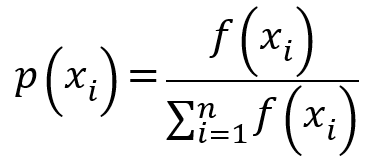

# 1. 问题介绍
>Q:m个旅行商去旅游 n个城市，规定都必须从同一个出发点出发，而且返回原出发点，需要将所有的城市遍历完毕，每个城市只能游历一次，但是为了路径最短可以路过这个城市多次。这个就是多旅行商问题。是在TSP问题的基础上进行了扩展。

TSP问题与mtsp问题的区别：

TSP指的是单个旅行商遍历一圈，将所有城市旅行一遍。

MTSP指的是将城市群划分成M个组，每组采用TSP得到最短的旅行路线，所以问题的关键在于如何确定城市群的分组。

# 2.图的描述


先将图转换为计算机可以识别的数据结构，利用python的networkx。
```python
import networkx as nx
import matplotlib.pyplot as plt
G = nx.Graph()
G.add_node("P", weight=0)#0
G.add_node("A", weight=1.7)
G.add_node("B", weight=0.8)
G.add_node("C", weight=1.3)
G.add_node("D", weight=2.8)
G.add_node("E", weight=1.9)
G.add_node("F", weight=3.5)
G.add_node("G", weight=0.9)
G.add_node("H", weight=0.3)
G.add_node("I", weight=1.2)
G.add_node("J", weight=0)#10

G.add_edge('A', 'P', capacity=5.0)
G.add_edge('A', 'B', capacity=4.0)
G.add_edge('P', 'B', capacity=8.0)
G.add_edge('C', 'B', capacity=3.0)
G.add_edge('C', 'P', capacity=7.0)
G.add_edge('C', 'D', capacity=4.0)
G.add_edge('D', 'E', capacity=3.0)
G.add_edge('C', 'J', capacity=5.0)
G.add_edge('D', 'J', capacity=2.0)
G.add_edge('E', 'J', capacity=2.0)
G.add_edge('J', 'P', capacity=2.0)
G.add_edge('E', 'P', capacity=4.0)
G.add_edge('F', 'P', capacity=12.0)
G.add_edge('E', 'F', capacity=10.0)
G.add_edge('F', 'G', capacity=4.0)
G.add_edge('G', 'P', capacity=9.0)
G.add_edge('G', 'H', capacity=5.0)
G.add_edge('F', 'H', capacity=7.0)
G.add_edge('H', 'I', capacity=9.0)
G.add_edge('H', 'P', capacity=12.0)
G.add_edge('I', 'A', capacity=3.0)
G.add_edge('I', 'P', capacity=6.0)
#利用代码将图生成并绘制出
pos = nx.spring_layout(G)
capacity = nx.get_edge_attributes(G, 'capacity')
weight = nx.get_node_attributes(G, 'weight')
nx.draw_networkx_nodes(G, pos)
nx.draw_networkx_edges(G, pos)
nx.draw_networkx_labels(G, pos)
nx.draw_networkx_edge_labels(G, pos, capacity)
points = range(len(weight))
points_coordinate = np.random.rand(len(weight), 2)
plt.show()
```
经过上述代码可以将数据结构导入计算机，针对问题需要得到由初始点开始到各个目的地的最短距离，经过Floyd算法处理得到，详细不在赘述。
# 3.解决方案
针对tsp这个np问题存在多种解决办法，想得到数据空间中的最优解当属穷举法，但是随着样本空间的扩张，实现意义不大存在O(n!)的运算规模。
| 算法 | 优点 | 缺点 |
| :----: |:----: | :----: |
| 穷举法 | 实现简单 | 时间和空间复杂度太大，不适合解决城市数太多的情况。 |
| 贪心算法 | 实现简单、计算速度快 | 容易得出局部最优解而不是全局最优解。 |
| 动态规划 | 随着城市数的增加，计算量大大减少，得到了中间各点到终点的最短路径。 | 同样不适合处理城市数太多的情况。 |
针对上述办法中利用贪心算法解决，可参考[利用退火算法解决tsp问题](https://github.com/deporation/math_program/tsp.py)下的tsp。py。

贪心算法利用盲目性，在很多时候是得不到全局最优解，但是会得到局部最优解。接下来介绍遗传算法。
## 3.1 遗传算法
遗传算法（Genetic Algorithm，GA）最早是由美国的 John holland于20世纪70年代提出,该算法是根据大自然中生物体进化规律而设计提出的。是模拟达尔文生物进化论的自然选择和遗传学机理的生物进化过程的计算模型，是一种通过模拟自然进化过程搜索最优解的方法。该算法通过数学的方式,利用计算机仿真运算,将问题的求解过程转换成类似生物进化中的染色体基因的交叉、变异等过程。在求解较为复杂的组合优化问题时,相对一些常规的优化算法,通常能够较快地获得较好的优化结果。遗传算法已被人们广泛地应用于组合优化、机器学习、信号处理、自适应控制和人工生命等领域。[^1]

其基本思路为：
1. 计算开始时，随机初始化一定数目的个体，并计算每个个体的适应度值，产生第一代 。
2. 如果不满足优化准则，开始新一代的计算：按照适应度值选择个体，产生下一代；父代按一定概率进行交叉操作，产生子代；所有的子代按一定概率变异，形成新的一代。计算新子代的适应度值。
3. 这一过程循环执行，直到满足优化准则为止。

```flow
st=>start: 随机产生初始种群
op1=>operation: 计算各个个体的适配度
op2=>operation: 复制选择
op3=>operation: 交叉
op4=>operation: 变异
cond1=>condition: 算法结果是否收敛
cond2=>condition: random[0,1] < $$\mathbf{p}_c  $$
cond3=>condition: random[0,1] < $$\mathbf{p}_m  $$
sub1=>subroutine: 子流程
io=>inputoutput: 输入输出框
e=>end: 结束框
st->op1->cond1->cond2
cond1(yes)->io->e
cond1(no)->op2->cond2
cond2(yes)->op3->cond3
cond2(no)->cond3
cond3(yes)->op4
cond3(no)->op1
op4->op1
```
图3.1 流程图 
>术语介绍
>基因型(genotype)：性状染色体的内部表现
>表现型(phenotype)：染色体决定的性状的外部表现，或者说，根据基因型形成的个体的外部表现；
>进化(evolution)：种群逐渐适应生存环境，品质不断得到改良。生物的进化是以种群的形式进行的；
>适应度(fitness)：度量某个物种对于生存环境的适应程度；
>选择(selection)：以一定的概率从种群中选择若干个个体。一般，选择过程是一种基于适应度的优胜劣汰的过程；
>复制(reproduction)：细胞分裂时，遗传物质DNA通过复制而转移到新产生的细胞中，新细胞就继承了旧细胞的基因；
>交叉(crossover)：两个染色体的某一相同位置处DNA被切断，前后两串分别交叉组合形成两个新的染色体。也称基因重组或杂交；
>变异(mutation)：复制时可能（很小的概率）产生某些复制差错，变异产生新的染色体，表现出新的性状；
>编码(coding)：DNA中遗传信息在一个长链上按一定的模式排列。遗传编码可看作从表现型到基因型的映射；
>解码(decoding)：基因型到表现型的映射；
>个体（individual）：指染色体带有特征的实体；
>种群（population）：个体的集合，该集合内个体数称为种群的大小。
### 3.1.1 目标函数
求解问题的目标，模型的最终结果,以
(式3.1)

的最大值为例。
其函数图像如图3.2

<center>图3.2 函数图像</center>

### 3.1.2 编码

  人类的染色体有四种碱基组成：腺嘌呤（A）、鸟嘌呤（G）、胞嘧啶（C）、胸腺嘧啶（T），共有两种组合方式A-T、C-G，相当于2 bit 的信息量。人类通过这简单的组合做到了世界上不存在两个相同的人，那在计算机中能不能也找到类似的一个方式去表示特征呢？
  受人类染色体编码方式的启发，结合计算机机器语言的特性，我们可以利用二进制编码的bitmap方式表示个体的特征：1000111011110101
  这里的‘0’、‘1’就可等同于两种碱基，用一条链将所有的碱基有序的串起来，因为每个数据都能表现出1 bit的信息便，所以主要其足够长便可以表示一个个体的特征。
  二进制的编码的方式简单直观，但明显地，当个体特征比较复杂的时候，需要大量的编码才能精确地描述，相应的解码过程（类似于生物学中的DNA翻译过程，就是把基因型映射到表现型的过程。）将过份繁复，为改善遗传算法的计算复杂性、提高运算效率，提出了浮点数编码：1.2 – 3.3 – 2.0 –5.4 – 2.7 – 4.3
### 3.1.2 适应度
  一个染色体确定一个个体，多个个体定义一个种群。在初始化种群后，为了估计种群中每个个体对我们的环境（也就是我们提出的问题——目标函数，可理解为袋鼠生存的珠穆朗玛峰）的存活率，引入适应度的概念f(X)。适应度函数在求解过程中通常都是我们自己定义的，若是求解最大值问题，则适应度函数值越高，生存几率越大，求解最小值也可通过一定方法变为求最大值问题计算其生存率。
### 3.1.2 选择
选择也就是优胜劣汰操作，在遗传算法中一般选择轮盘赌方法(Roulette Wheel Selection method)，也可选择其他方法。事先知道计算适应度的指标，就像知道袋鼠所在海拔越高适应性越强，适应度越高被选中的概率越高，轮盘赌的主要思想为个体被选中的概率与其适应度函数的大小成比列。用公式表示概率为：
(式3.2)
就目标函数而言,给出以下种群进行轮盘赌选择：
表3.1 轮盘赌  
| x | f(x) | p(x) |
| :----: |:----: | :----: |
|2(00000010)|1.2|0.03|
|3(00000101)|4.429|0.12|
|9(00001001)|12.67|0.35|
|17(00010001)|17.6|0.5|  

<center>图3.3 轮盘赌结果</center>
由表和图可见，特征为9(00001001)、17(00010001)的个体在“竞争”中存活率更高.

### 3.1.3 交叉
类比生物中的基因重组，不同基因重新组合产生新的基因，是有一定概率性的事件。在遗传算法中，不同的“亲代”个体进行随机交叉产生新的“子代”个体，同样也是一个有概率的事件，基本遗传算法一般采用单点交叉法。交叉算子是遗传算法中的关键部分。
在上一个步骤中，已经选择出了可以产生后代的亲本染色体。所谓「交叉」，其实就是指的繁殖。现在来对染色体 1 和 4（在上一个步骤中选出来的）进行「交叉」，见下图3.4：

<center>图3.4 单点交叉</center>

### 3.1.4 变异
从生物学角度看，后代的生长过程中，它们体内的基因会发生一些变化，使得它们与父母不同。这个过程称为「变异」，它可以被定义为染色体上发生的随机变化，正是因为变异，种群中才会存在多样性。过程如图3.5：

<center>图3.4 变异示例</center>
完整过程如图3.5：


<center>图3.5 完整过程</center>

~~未完~~

# 参考文献
[^1]:郑树泉．工业智能技术与应用[M]．上海：上海科学技术出版社，2019：250-251